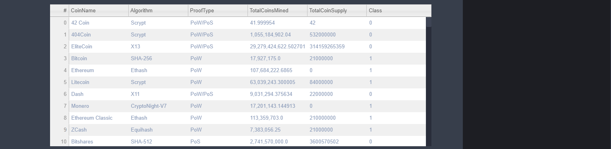

# Cryptocurrencies

## Overview 

The project is to ascertain grouping for different cryptocurrencies which are present in trading market. Available data needs to be cleaned and processed to fit machine learning model using python. To keep the model cost effective, reducing dimensions is required to be employed and perform clustering of the data using K-Means (un-supervised machine learning) model. Finally, clustered data need to be visualized in table, 2D and 3D graph as required. 

## Purpose

The purpose of this analysis is to classify cryptocurrencies getting traded in the market 

## Results

The elbow curve clearly show an elbow at 4 and hence 4 clusters are considered for the model.

Snapshot of table which shows different cryptocurrencies classified in 4 different classes which can be used for further analysis

A 2D graph showing the classification of the cryptocurrencies 

A more detailed 3D graph showing classification with more significance
